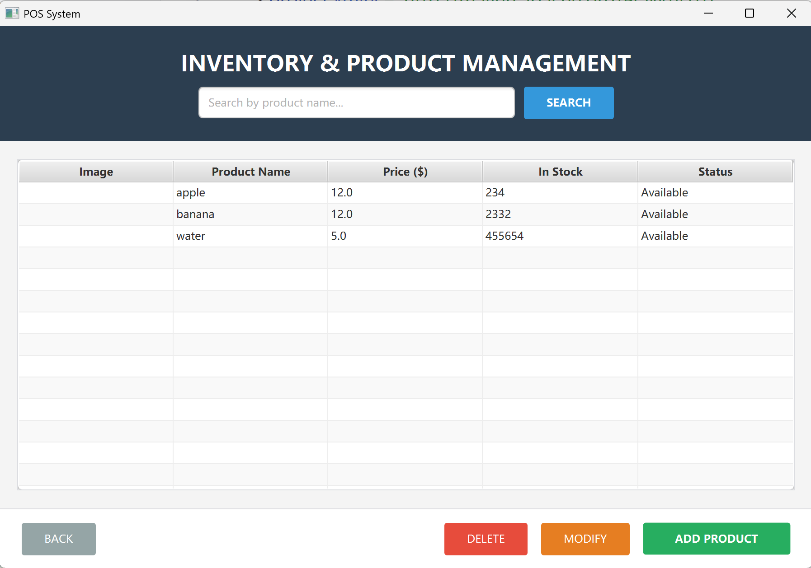
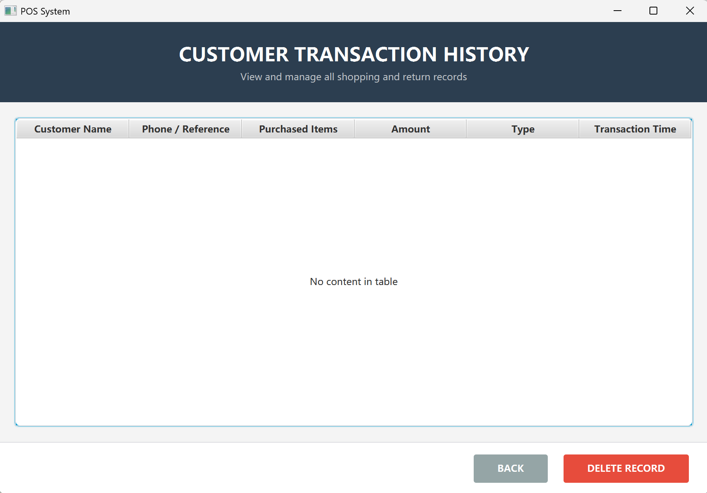
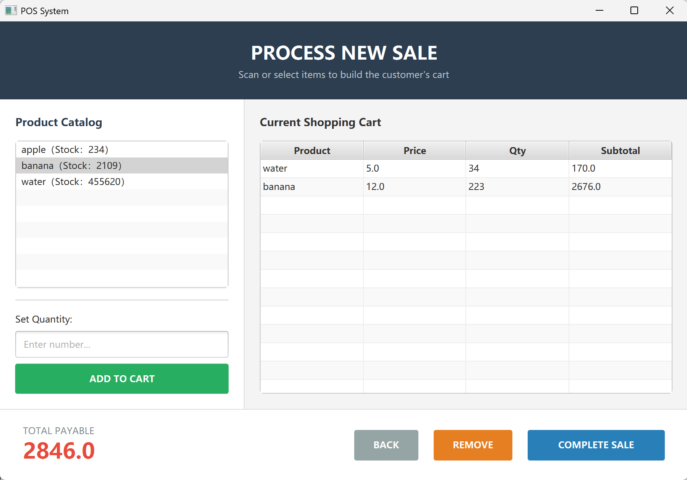
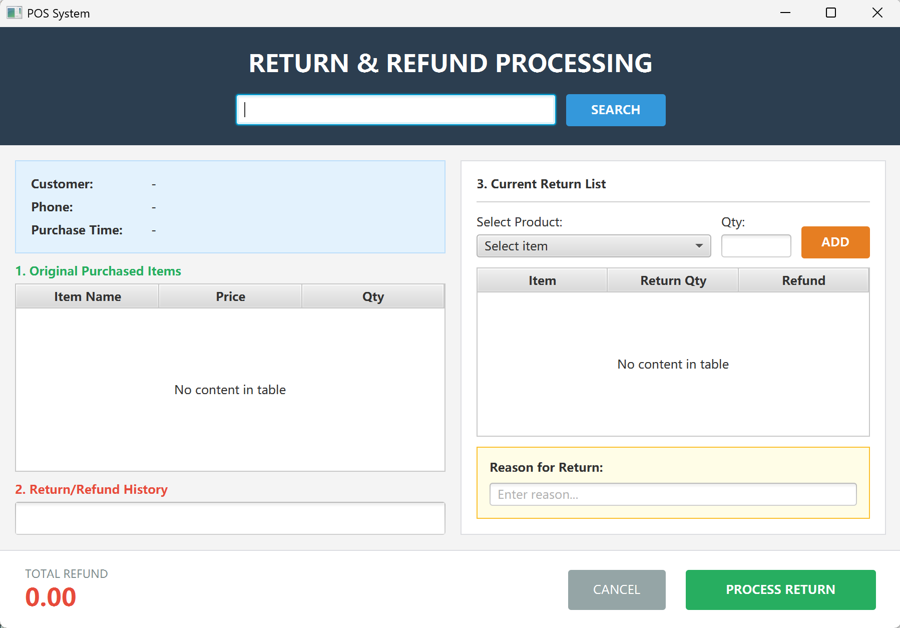

# Point-of-Sale (PoS) System

A retail management solution built using the **Maven** lifecycle and **JavaFX**. This project demonstrates a clean separation of concerns through layered architecture and implements core retail workflows including inventory tracking, sales transactions, and return processing.

## 🚀 Core Functionalities

### 1. Inventory & Stock Management
* **Dynamic Inventory**: Real-time tracking of stock levels with automatic status updates.
* **Product Registry**: Full management (Create, Read, Update, Delete) of product descriptions, and pricing.
* **Search Engine**: Filterable product lists for quick item lookup during manual entry.

### 2. Process Sales Workflow
* **Transaction Processing**: Virtual shopping cart that calculates sub-totals, taxes, and grand totals dynamically.
* **Payment Logic**: Handles cash payments, calculates precise change, and validates transaction completion.
* **Data Integrity**: Atomic updates ensure that stock levels are deducted immediately upon a successful sale.

### 3. Return & Refund System
* **Verification**: Validates returns against unique Receipt/Invoice IDs to prevent fraudulent claims.
* **Logic Constraints**: Ensures return quantities do not exceed original purchase amounts.
* **Inventory Restoration**: Automatically adds returned items back into the active stock count.

### 4. Management Reporting
* **Transaction Logs**: Persistent storage of all historical sales and returns.
* **Auditing**: Detailed view of specific transaction line items for managerial review.

## 🖼️ System Preview

| Inventory Management | Transaction History |
|---|---|
|  |  |

| Process Sale | Handle Return |
|---|---|
|  |  |
